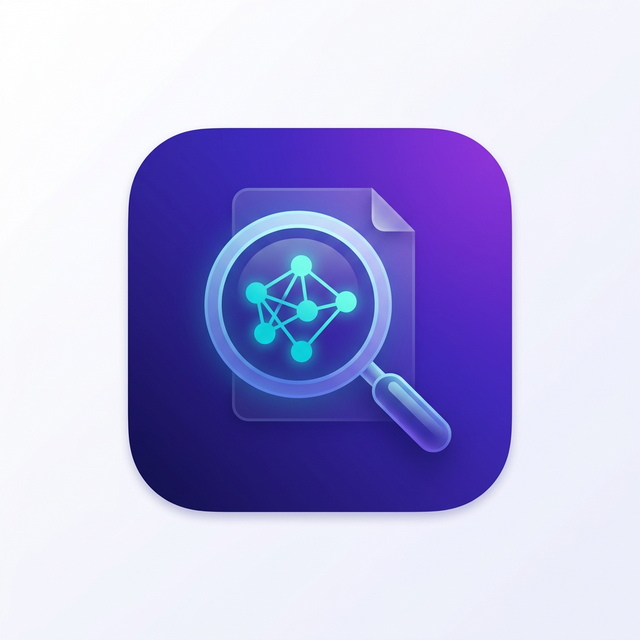
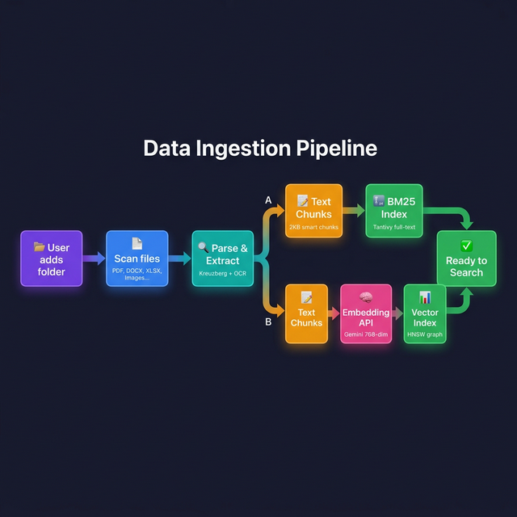
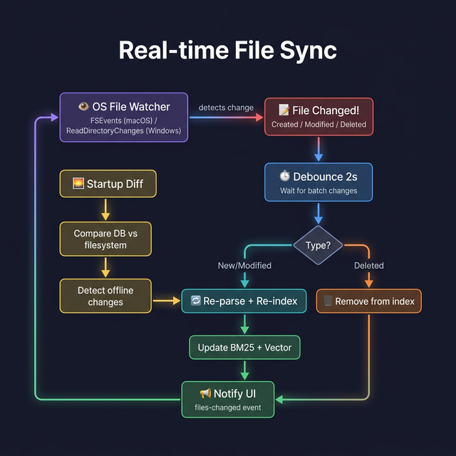
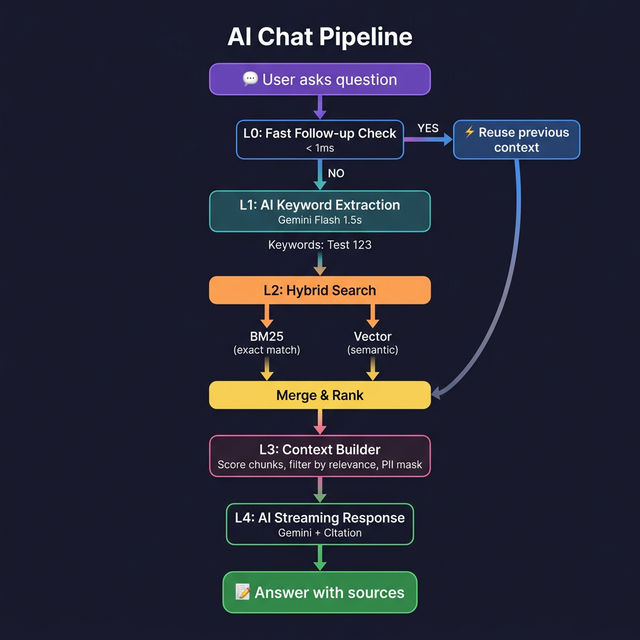

<p align="center">
  
</p>

<h1 align="center">DocuMind</h1>
<p align="center">
  <strong>Ứng dụng tìm kiếm tài liệu thông minh — triển khai mô hình RAG hoàn chỉnh trên desktop</strong>
</p>

<p align="center">
  <a href="https://github.com/azoom-pham-the-tho/rag-search/releases"></a>
  <a href="https://github.com/azoom-pham-the-tho/rag-search/actions"></a>
  
</p>

---

## Mô hình RAG là gì?

**RAG (Retrieval-Augmented Generation)** là một kiến trúc AI gồm 3 giai đoạn:

```
  ┌─────────────┐      ┌─────────────┐      ┌─────────────┐
  │  RETRIEVAL   │ ───→ │ AUGMENTATION │ ───→ │ GENERATION   │
  │  Tìm kiếm   │      │  Bổ sung     │      │  Sinh câu    │
  │  tài liệu   │      │  ngữ cảnh    │      │  trả lời     │
  └─────────────┘      └─────────────┘      └─────────────┘
```

**Tại sao cần RAG?** — AI (ChatGPT, Gemini) rất giỏi ngôn ngữ, nhưng chúng **không biết nội dung tài liệu riêng của bạn**. RAG giải quyết bằng cách: tìm thông tin liên quan trong tài liệu trước → đưa vào prompt → AI trả lời chính xác kèm nguồn trích dẫn.

Nhưng trước khi "Retrieval" hoạt động được, cần **một giai đoạn chuẩn bị** để tài liệu sẵn sàng được tìm kiếm. Vậy một hệ thống RAG hoàn chỉnh có **4 giai đoạn**:

```
  ┌─────────────┐      ┌─────────────┐      ┌─────────────┐      ┌─────────────┐
  │  INGESTION   │ ───→ │  RETRIEVAL   │ ───→ │ AUGMENTATION │ ───→ │ GENERATION   │
  │              │      │              │      │              │      │              │
  │  Nạp & xử lý│      │  Tìm kiếm    │      │  Lọc, xếp    │      │  AI sinh     │
  │  tài liệu   │      │              │      │  hạng, ghép   │      │  câu trả lời │
  └─────────────┘      └─────────────┘      └─────────────┘      └─────────────┘
    Chạy 1 lần           Mỗi câu hỏi         Mỗi câu hỏi         Mỗi câu hỏi
    (+ auto sync)
```

Dưới đây là cách **DocuMind** triển khai từng giai đoạn, kèm hướng nâng cấp nếu muốn đưa hệ thống lên tầm cao hơn.

---

## Giai đoạn 1: Ingestion — Nạp & xử lý tài liệu

> _"Biến tài liệu thô thành dữ liệu có thể tìm kiếm"_

<p align="center">
  
</p>

### Bước 1 — Document Parsing (Đọc file)

Hệ thống dùng engine **Kreuzberg** (Rust) để đọc 75+ định dạng:

| Loại        | Formats             | Cách xử lý                          |
| ----------- | ------------------- | ----------------------------------- |
| Văn bản     | PDF, DOCX, ODT, RTF | Extract text + giữ heading          |
| Bảng tính   | XLSX, XLS, CSV      | Từng sheet, giữ header              |
| Trình chiếu | PPTX, PPT, ODP      | Extract text từ slides              |
| Web         | HTML, XML, JSON     | Parse markup → plain text           |
| Ảnh         | JPG, PNG, TIFF, BMP | **OCR** (Tesseract) — nhận dạng chữ |

> 💡 OCR bundle sẵn trong app (Tesseract static-linked + tessdata Eng/Vie/Jpn) — không cần cài thêm.

### Bước 2 — Chunking (Chia nhỏ văn bản)

Tài liệu dài không thể đưa hết vào AI (giới hạn context window). Hệ thống chia thành **chunks** ~2KB có overlap:

```
Tài liệu gốc (50 trang):
┌───────────────────────────────────────┐
│ ▓▓▓▓▓▓▓▓ Chunk 1 (2KB) ▓▓▓▓▓▓▓▓     │
│            ░░ overlap ░░              │
│            ▓▓▓▓▓▓▓▓ Chunk 2 ▓▓▓▓▓▓▓▓ │
│                       ░░ overlap ░░   │
│                       ▓▓▓▓ Chunk 3... │
└───────────────────────────────────────┘
```

### Bước 3 — Dual Indexing (Index kép)

Mỗi chunk được đưa vào **2 hệ thống tìm kiếm cùng lúc**:

```
                 ┌─────────────────────┐
                 │     Text Chunks      │
                 └────────┬────────────┘
                          │
              ┌───────────┴───────────┐
              ▼                       ▼
   ┌──────────────────┐   ┌──────────────────┐
   │   BM25 Index      │   │  Vector Index     │
   │   (Tantivy)       │   │  (HNSW 768-dim)   │
   │                   │   │                   │
   │ Tìm chính xác:   │   │ Tìm ngữ nghĩa:   │
   │ "hóa đơn 12345"  │   │ "ship" ≈ "vận     │
   │                   │   │  chuyển"          │
   └──────────────────┘   └──────────────────┘
```

**Tại sao cần 2 index?**

- BM25 giỏi match từ khóa chính xác: `"ABC-12345"` → match đúng
- Vector hiểu đồng nghĩa: `"chi phí ship"` ≈ `"phí vận chuyển"`
- Kết hợp = **Hybrid Search** — ưu điểm cả hai

### Bước 4 — Auto Sync

<p align="center">
  
</p>

Dùng **OS-native file watcher** lắng nghe thay đổi → tự re-index (debounce 2s).

### 🚀 Nâng cấp Ingestion — Hướng phát triển

| Hiện tại                | Nâng cấp                                                                    | Lợi ích                                          |
| ----------------------- | --------------------------------------------------------------------------- | ------------------------------------------------ |
| Fixed-size chunks (2KB) | **Semantic Chunking** — cắt theo đoạn ý nghĩa (dùng AI phát hiện ranh giới) | Chunks chất lượng hơn, tránh cắt giữa ý tưởng    |
| Text-only extraction    | **Multimodal Ingestion** — hiểu biểu đồ, hình vẽ trong PDF bằng Vision AI   | Tăng coverage, hiểu cả hình ảnh trong tài liệu   |
| Gemini Embedding API    | **Local Embedding** — chạy model embedding offline (gte-small, bge-m3)      | Không cần internet, nhanh hơn, free, bảo mật hơn |
| Chunk → embed riêng lẻ  | **Parent-Child Chunking** — chunk nhỏ để tìm, trả về chunk cha lớn hơn      | Context phong phú hơn cho AI                     |
| Flat metadata           | **Metadata Extraction** — AI tự trích xuất (ngày, tác giả, loại tài liệu)   | Filter search theo metadata                      |

---

## Giai đoạn 2: Retrieval — Tìm kiếm

> _"Từ câu hỏi, tìm ra chunks liên quan nhất"_

<p align="center">
  
</p>

### Layer 0 — Fast Follow-up `(<1ms)`

Kiểm tra câu hỏi có phải tiếp nối không:

| Signal             | Ví dụ                | Hành động           |
| ------------------ | -------------------- | ------------------- |
| Đại từ             | "**nó** là gì?"      | Dùng lại context cũ |
| Từ tiếp nối        | "**thêm** chi tiết"  | Dùng lại context cũ |
| Keyword trùng >40% | Cùng topic           | Dùng lại context cũ |
| Topic mới          | "Tìm về nghiệp vụ X" | **Tìm kiếm lại**    |

### Layer 1 — AI Keyword Extraction `(~1.5s)`

Dùng **Gemini Flash** trích từ khóa thông minh:

```
Input:  "Cho tôi hóa đơn tháng 3 của ABC"
Output: keywords=["hóa đơn", "tháng 3", "ABC"], intent="lookup"
```

- Hiểu context hội thoại (biết "nó" chỉ cái gì)
- Giữ compound term ("Test 123" ≠ "Test" + "123")
- Fallback heuristic nếu AI timeout

### Layer 2 — Hybrid Search `(~40ms)`

Chạy **song song** 2 engine (`tokio::join!`):

```
Keywords → BM25 (Tantivy)  → top 10 (exact match)
         → Vector (HNSW)   → top 15 (semantic)
                    ↓
           Merge & Re-rank → Top files
```

### 🚀 Nâng cấp Retrieval — Hướng phát triển

| Hiện tại            | Nâng cấp                                                                    | Lợi ích                                              |
| ------------------- | --------------------------------------------------------------------------- | ---------------------------------------------------- |
| Keyword extraction  | **Query Expansion** — AI tự sinh thêm câu query đồng nghĩa, tìm nhiều góc   | Recall cao hơn, không miss kết quả                   |
| Single-hop search   | **Multi-hop Retrieval** — tìm → đọc → hỏi lại → tìm thêm (agentic RAG)      | Trả lời câu hỏi phức tạp cần nhiều bước suy luận     |
| Score-based ranking | **Cross-Encoder Re-ranking** — dùng model AI chấm điểm lại top kết quả      | Precision cao hơn nhiều, giảm noise                  |
| Fixed top-N         | **Adaptive Retrieval** — tùy câu hỏi lấy 3 hoặc 30 chunks                   | Tối ưu context, tránh thiếu/thừa                     |
| Standalone search   | **Knowledge Graph** — xây dựng quan hệ giữa entities (người, công ty, ngày) | Trả lời câu hỏi quan hệ: "ai liên quan đến dự án X?" |

---

## Giai đoạn 3: Augmentation — Bổ sung ngữ cảnh

> _"Chọn lọc và chuẩn bị context tốt nhất cho AI"_

Không phải cứ tìm được là đưa hết cho AI — cần **lọc, xếp hạng, cắt gọn**.

### Context Builder

**Chunk Scoring — AND-majority rule:**

Mỗi chunk phải chứa **≥50% keywords** mới được chọn:

```
Keywords: ["hóa đơn", "tháng 3", "ABC"]

Chunk A: "Hóa đơn ABC ngày 15/3..."  → 3/3 = 100% ✅
Chunk B: "Hóa đơn tháng 5 XYZ..."    → 1/3 = 33%  ❌
Chunk C: "Doanh thu tháng 3 ABC..."   → 2/3 = 67%  ✅
```

**Dynamic Budget — ngân sách theo intent:**

| Intent      | Budget     | Lý do                      |
| ----------- | ---------- | -------------------------- |
| `lookup`    | 40K chars  | Chỉ cần vài dòng chính xác |
| `summarize` | 120K chars | Cần đọc nhiều              |
| `compare`   | 80K chars  | Cần dữ liệu từ nhiều nguồn |

**PII Masking** — Che số điện thoại → `[SĐT]`, email → `[EMAIL]` trước khi gửi AI.

### 🚀 Nâng cấp Augmentation — Hướng phát triển

| Hiện tại                   | Nâng cấp                                                                               | Lợi ích                                      |
| -------------------------- | -------------------------------------------------------------------------------------- | -------------------------------------------- |
| Fixed rule (≥50% keywords) | **Learned Ranking** — train model chấm điểm chunk phù hợp                              | Scoring chính xác hơn rule-based             |
| Trả raw text               | **Context Compression** — AI tóm tắt chunks trước khi đưa vào prompt                   | Fit nhiều thông tin hơn trong context window |
| PII regex                  | **NER-based masking** — dùng Named Entity Recognition phát hiện PII chính xác          | Ít false positive, bảo mật tốt hơn           |
| Single context             | **Multi-perspective** — tạo context từ nhiều góc nhìn cho cùng câu hỏi                 | Câu trả lời toàn diện hơn                    |
| No verification            | **Hallucination Detection** — AI tự kiểm tra xem câu trả lời có đúng với context không | Giảm bịa, tăng tin cậy                       |

---

## Giai đoạn 4: Generation — AI sinh câu trả lời

> _"AI đọc context, trả lời bằng ngôn ngữ tự nhiên, kèm nguồn trích dẫn"_

### Prompt Engineering

Prompt khác nhau tùy loại câu hỏi:

```
[System] Bạn là trợ lý tìm kiếm tài liệu. Trả lời DỰA TRÊN context.
         Trích dẫn nguồn [1], [2]...

[Context] === invoices.xlsx ===
          STT | Mã HĐ | Công ty | Tháng | Số tiền
          1   | HD001  | ABC     | 3     | 50,000,000đ

[History] User hỏi về hóa đơn, tìm được file invoices.xlsx

[Query]   Cho tôi hóa đơn tháng 3 của ABC
```

### Streaming + Citation

- **Streaming**: Từng token hiện dần (như ChatGPT)
- **Citation**: AI cite nguồn → hệ thống verify file thật sự được dùng
- **Key rotation**: Rate limit → tự chuyển sang key khác

### 🚀 Nâng cấp Generation — Hướng phát triển

| Hiện tại              | Nâng cấp                                                                           | Lợi ích                                               |
| --------------------- | ---------------------------------------------------------------------------------- | ----------------------------------------------------- |
| Single model (Gemini) | **Multi-LLM Router** — dùng model nhỏ cho câu đơn giản, model lớn cho câu phức tạp | Tiết kiệm chi phí + tốc độ                            |
| Text output           | **Structured Output** — trả kết quả dạng bảng, JSON, chart                         | UX tốt hơn cho data-heavy queries                     |
| No evaluation         | **RAGAS / RAG Evaluation** — đo Faithfulness, Relevancy, Context Precision         | Đánh giá chất lượng pipeline bằng số liệu             |
| Stateless prompt      | **Chain-of-Thought** — yêu cầu AI suy luận từng bước                               | Trả lời chính xác hơn cho câu hỏi phức tạp            |
| No self-correction    | **Self-RAG** — AI tự đánh giá: cần tìm thêm? câu trả lời đủ chưa?                  | Tự cải thiện chất lượng, biết khi nào cần search thêm |
| Cloud API only        | **Local LLM** — chạy model offline (Ollama, llama.cpp)                             | 100% offline, zero API cost, bảo mật tuyệt đối        |

---

## So sánh với RAG thông thường

| Tiêu chí       | RAG cloud (LangChain, LlamaIndex) | DocuMind                    |
| -------------- | --------------------------------- | --------------------------- |
| Chạy ở đâu     | Server / Cloud                    | **100% trên máy cá nhân**   |
| Dữ liệu đi đâu | Upload lên server                 | **Không bao giờ rời máy**   |
| Cần setup      | Python, Docker, vector DB         | **Download → Cài → Dùng**   |
| Tìm kiếm       | Thường chỉ vector                 | **Hybrid BM25 + Vector**    |
| OCR            | Cần cài riêng                     | **Bundle sẵn**              |
| Đồng bộ        | Manual re-index                   | **Auto watcher**            |
| Follow-up      | Search lại mỗi câu                | **Fast follow-up <1ms**     |
| Ngôn ngữ       | Python                            | **Rust (nhanh, type-safe)** |

---

## Tổng quan nâng cấp — RAG Maturity Model

```
Level 1: Naive RAG (cơ bản)          ← DocuMind hiện tại ở đây
├── Chunk → Embed → Search → Generate
├── Fixed chunking, single index
└── Stateless prompt

Level 2: Advanced RAG
├── Semantic chunking + metadata
├── Hybrid search + cross-encoder re-ranking
├── Query expansion + context compression
└── Evaluation metrics (RAGAS)

Level 3: Modular RAG
├── Multi-hop retrieval (agentic)
├── Knowledge graph + entity linking
├── Self-RAG (tự đánh giá & retry)
├── Multi-LLM routing
└── Local LLM offline capability

Level 4: Agentic RAG
├── AI agent tự quyết tìm ở đâu, hỏi gì
├── Tool use (search, calculator, code execution)
├── Planning + reflection
└── Multi-agent collaboration
```

> DocuMind đã triển khai Naive RAG hoàn chỉnh + một số features của Advanced RAG (hybrid search, fast follow-up, dynamic budget, PII masking). Các mục "Nâng cấp" ở trên trình bày lộ trình lên Level 2–4.

---

## Công nghệ sử dụng

### Backend — Rust

| Thành phần       | Công nghệ                   | Vai trò                     |
| ---------------- | --------------------------- | --------------------------- |
| Framework        | **Tauri v2**                | Desktop app, IPC bridge     |
| Full-text Search | **Tantivy**                 | BM25 inverted index         |
| Vector Search    | **HNSW** (instant-distance) | 768-dim cosine similarity   |
| Database         | **SQLite** (rusqlite)       | Metadata, settings, history |
| Document Parser  | **Kreuzberg**               | 75+ formats + OCR           |
| OCR              | **Tesseract** (static)      | Eng + Vie + Jpn             |
| AI API           | **Gemini**                  | Chat streaming + embedding  |
| File Watcher     | **notify**                  | OS-native FS events         |
| Runtime          | **Tokio + Rayon**           | Async I/O + parallel CPU    |

### Frontend — Vanilla JS + CSS

- Zero framework, dark theme, real-time streaming UI

### CI/CD — GitHub Actions

- Auto build khi push tag → macOS `.dmg` + Windows `.msi`/`.exe`

---

## Cài đặt

### Download

👉 [**Releases**](https://github.com/azoom-pham-the-tho/rag-search/releases)

### Yêu cầu

- [Gemini API key](https://aistudio.google.com/apikey) (miễn phí)

### Sử dụng

1. Cài app → Settings → Nhập API key
2. Thêm thư mục tài liệu → Đợi index
3. Bắt đầu chat!

### Development

```bash
brew install rust node tesseract
git clone git@github.com:azoom-pham-the-tho/rag-search.git
cd rag-search && npm install
npm run tauri dev
```

---

<p align="center">
  Built with ❤️ using <strong>Rust</strong> + <strong>Tauri v2</strong> + <strong>Gemini AI</strong>
</p>
